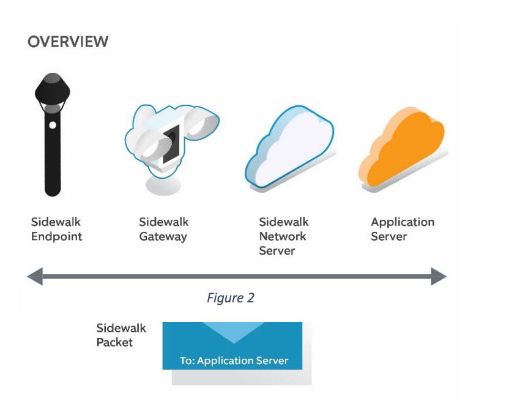
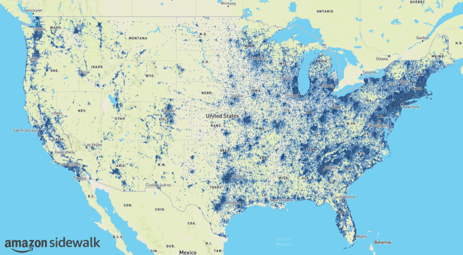

## `_nomap` Please

Recently, I learned a bit about [Wi-Fi Positioning Systems (WPS)](https://en.wikipedia.org/wiki/Wi-Fi_positioning_system) that are used by major players like [Apple](https://support.apple.com/en-us/102515) and [Google](https://support.google.com/maps/answer/1725632?hl=en). These systems commonly use nearby Wi-Fi access points (APs) and their received signal strength indicator (RSSI) to locate a device. This technology is built into most flagship devices today and opting out usually means losing the ability for your device to know its own location [^1].

Owners of APs are able to opt-out of being tracked by appending `_nomap` to the end of their network's name (SSID). Apple, Google, Mozilla, and some independent crowd-sourced projects like [beaconDB](https://beacondb.net/), the self-described _public domain wireless geolocation database_, all support this suffix for opting out. This is, however, not a universal standard and some other major players like Microsoft, who enjoys their _individuality_, do not support this.

To opt out of tracking, _the big M_ asks that you visit their [opt-out page](https://account.microsoft.com/privacy/location-services-opt-out) and provide the MAC address of the hardware that advertises your Wi-Fi signal.
While I am unsure if this is Microsoft exercising their _discretion_ or being more transparent than other providers, they note that if "a request seems problematic, it may not be added to the block list" so there might be times where you request an opt-out and have that request denied.

## Interconnected <s>Highway</s> Sidewalk

This would not be a true major-players/FAANG/big-tech/MAANG/acronym-of-the-month blog post if Amazon was not involved. Amazon, walking in lockstep with its big-tech brethren, [introduced](https://www.aboutamazon.com/news/devices/introducing-amazon-sidewalk) Amazon Sidewalk (pun-intended) to the U.S. in late 2019.

Amazon Sidewalk enables certain Amazon (and [their subsidiaries](https://static.ring.com/docs/press/press-release.pdf)) devices (Sidewalk Gateways) to act as bridges [^3] that use a portion of their bandwidth [^4] to send data for devices compatible with Sidewalk (Sidewalk Endpoints). These endpoints will then use the Sidewalk Network Service operated by Amazon to deliver packets of information to various application servers which may be owned by Amazon or by a third party. You can review Amazon's [whitepaper](https://m.media-amazon.com/images/G/01/sidewalk/final_privacy_security_whitepaper.pdf) on Sidewalk for more in-depth information

Similar to Apple's AirTag, Sidewalk is powered by Bluetooth (and 900 MHz LoRa), but it is especially impressive with a range of up to half a mile. I also thought it would be worthwhile to note that this is the same network that powers the AirTag's rival - [the Tile tracker](https://support.life360.com/hc/en-us/articles/30582972753559-Tile-Amazon-Sidewalk).

Amazon has [noted](https://www.aboutamazon.com/news/devices/everything-you-need-to-know-about-amazon-sidewalk#:~:text=It%E2%80%99s%20already%20accessible%20to%20more%20than%2090%25%20of%20the%20U.S.%20population.) that their network covers more than 90% of the U.S. population, and this can be confirmed if you look at their [public coverage map](https://coverage.sidewalk.amazon/).

Per this [help article](https://www.amazon.com/gp/help/customer/display.html?nodeId=GZ4VSNFMBDHLRJUK) I found, opting out of Sidewalk seems quite easy for end users - though I am unsure if opting out means your own endpoint devices would also not be able to use the Sidewalk network

# Where's the Chaos?

It has already been shown that these crowd-sourced geo-location systems can be misused by bad actors in _[Surveilling the Masses with Wi-Fi-Based Positioning Systems](https://arxiv.org/abs/2405.14975)_ by [Erik Rye](https://arxiv.org/search/cs?searchtype=author&query=Rye,+E) and [Dave Levin](https://arxiv.org/search/cs?searchtype=author&query=Levin,+D). In this paper, they explore how datasets like these can be misused by "merely exploiting the fact that there are relatively few dense regions of allocated MAC address space." [^2]

Earlier this year, we also saw the [_nRootTag_ compromise](https://cec.gmu.edu/news/2025-02/find-my-hacker-how-apples-network-can-be-potential-tracking-tool) found by George Mason University researchers that enables stealth tracking of Bluetooth devices by making them broadcast themselves as lost AirTags to nearby Apple devices.

# Closing Thoughts

This post simply aggregated useful bits of information I found on this topic while looking into it, and there were far more pieces of information I wanted to tie in, but at that point this would become a case study.

I don't _think_ there is inherently a problem with systems like these. I find them incredibly interesting and useful for end-users, but we **cannot ignore the security implications** that come with widespread, interconnected systems like these. While writing this post, an [article](https://www.404media.co/flock-exposed-its-ai-powered-cameras-to-the-internet-we-tracked-ourselves/) (and accompanying [video](https://youtu.be/vU1-uiUlHTo?si=OZB9i-2FT5l1umBz)) was released detailing how Flock Safety's widespread camera system had a number of devices open to the internet and how this posed not only significant privacy and security risks, but psychological ones as well.

While these systems are not uniquely American, I've continuously heard this sentiment expressed: "What would our forefathers think of this?"

[^4]: Up to 500MB per account per month and 80Kbps upload speed
[^3]: They're officially referred to as _Amazon Sidewalk Gateways_ or _Sidewalk Bridges_
[^2]: [arXiv:2405.14975](https://arxiv.org/abs/2405.14975) [cs.CR] | Surveilling the Masses with Wi-Fi-Based Positioning Systems - Erik Rye, Dave Levin |
[^1]: Apple and Google have tied this into their [Location Services](https://support.apple.com/en-us/102647) and [Location Accuracy](https://support.google.com/android/answer/3467281#location_accuracy) offerings, respectively. Apple seems a bit more restrictive as turning off Location Services means that your device loses its ability to locate itself entirely, but with Google/Android's Location Accuracy you seem to be able to [turn it off](https://support.google.com/android/answer/3467281) and still retain the ability for your device to locate itself...albeit more inaccurately.
