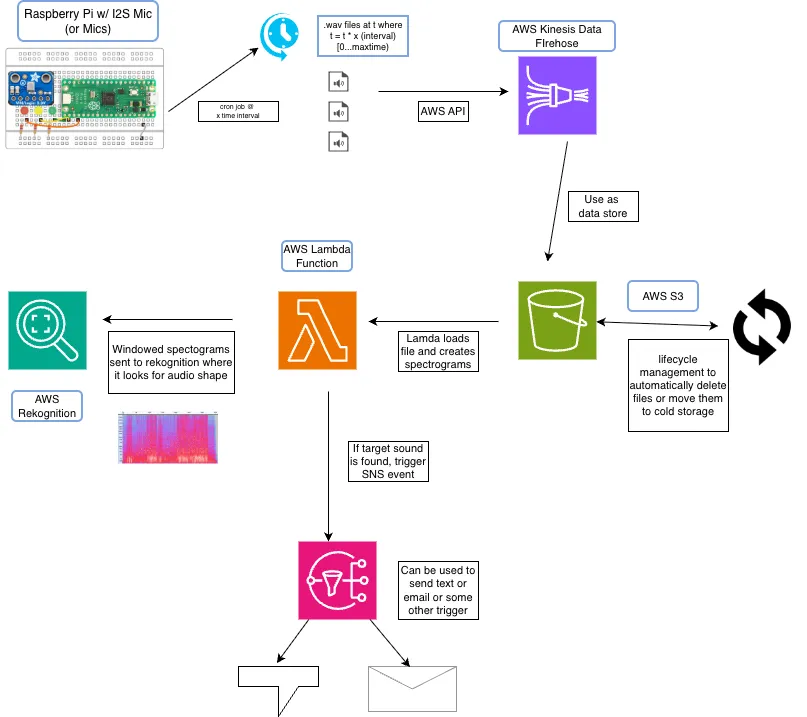

# Intro

Much of the functionality behind this is described in this Amazon machine learning write-up [here](https://aws.amazon.com/blogs/machine-learning/detect-audio-events-with-amazon-rekognition/). This solution aims to describe an IoT sound detection/analysis using machine learning for use cases regarding firearm safety and alerting.

# How Do We Capture Sound?

We can leverage a small IoT device-like setup using something like a [Raspberry Pi Pico](https://www.raspberrypi.com/products/raspberry-pi-pico/) or [Zero](https://www.raspberrypi.com/products/raspberry-pi-zero/) (or [MSP430](https://www.ti.com/microcontrollers-mcus-processors/msp430-microcontrollers/overview.html)) which would allow us to run a small Python Script to capture audio and eventually convert them to spectrograms that could then be used for image analysis and labeling.

The IoT devices alone would not allow us to capture audio so we would have to pair this with some other solution that would allow us to do so. I took a look at a few Adafruit options such as the [PDM MEMS Microphone](https://www.adafruit.com/product/3492), the [I2S MEMS Microphone](https://www.adafruit.com/product/3421), or the [Electret Microphone Amplifier (w/ Adjustable Gain)](https://www.adafruit.com/product/1063?gad_source=1&gclid=CjwKCAjwkuqvBhAQEiwA65XxQHe3jAjqpU0v_XDNDbXJCrdvrsYmrcYeFRL4VcEjmexbikw-BFcHUhoCxhkQAvD_BwE).

## The Case for the Electret Microphone

The electret microphone would be great as it is best used for “projects such as voice changers, audio recording/sampling, and audio-reactive projects that use FFT” but we would need to use something like an Arduino or microchip to convert the analog signal to a digital value if an RPI Pico is not used - the Pico uses the [RP2040](https://datasheets.raspberrypi.com/rp2040/rp2040-datasheet.pdf) MCU which has a 4 channel Analog-to-Digital Converter (ADC). Something like a [MCP3008](https://www.microchip.com/en-us/product/mcp3008) 10-bit ADC could be used to do so. The MCP3008 “combines high performance and low power consumption in a small package, making it ideal for embedded control applications.“

## The Case for the PDM Microphone

If the electret microphone adds too much additional complexity, the PDM microphone could be used as it provides an analog output natively. On this microphone, as the name implies, the “digital interface is a very simplistic **p**ulse **d**ensity **m**odulation output.” The product page notes “it's digital but its *not* PWM and it's *not* I2S.” There is an example implementation of a microphone using an RPi Pico and a PDM [here](https://www.hackster.io/sandeep-mistry/create-a-usb-microphone-with-the-raspberry-pi-pico-cc9bd5).

## The Case for the I2S Microphone

The other options sound great until you realize that an ADC like the MCP3008 is not suitable (though it is possible) for recording sound due to the sampling that needs to happen. Internet forums (which of course are _always_ a source of truth) note that an I2C microphone would be ideal as all PI’s have a I2S interface that you can make use of (forum posts I reviewed [here](https://forums.raspberrypi.com/viewtopic.php?t=353806) and [here](https://forums.raspberrypi.com/viewtopic.php?p=1185062&hilit=record+audio+from+analog+microphone#p1185062)). The I2S mic describes itself as a “small, low-cost MEMS mic with a range of about 50Hz - 15KHz, good for just about all general audio recording/detection” which sounds pretty ideal for the use case of sound detection/analysis. There is a [write-up on the Adafruit website](https://learn.adafruit.com/adafruit-i2s-mems-microphone-breakout/raspberry-pi-wiring-test) that details a setup of using this I2S microphone for both stereo and mono audio capture using a [script](https://raw.githubusercontent.com/adafruit/Raspberry-Pi-Installer-Scripts/master/i2smic.py). A lot of the groundwork is done here if this route is taken

## PDM, PWM, I2S, and Analog…What?

I too had to look up these terms, use a bit of AI, and understand what the tradeoffs and differences are and I will share these below.

> 💡 TLDR: analog is king but our other microphones can be ideal.

### Analog

This is the natural way sound exists in the real world. It's a continuous signal where the voltage of an electrical signal constantly changes to represent the pressure waves of sound. See this sample image from the PDM microphone [product page](https://learn.adafruit.com/adafruit-pdm-microphone-breakout/) that denotes a comparison between PDM and analog sine waves.

### PDM (Pulse Density Modulation)

This is a digital way to represent an analog audio signal using only one bit - so good ol’ 1’s and 0’s. A high density of pulses (1s) represents a high volume, and a low density of pulses (0’s) represents a low volume. PDM requires a high sampling rate (millions of times per second) to accurately represent the analog signal.

### I2S (Inter-IC Sound)

This is a digital serial interface commonly used to transmit audio data between integrated circuits (ICs) like microchips; it uses multiple bits to represent the audio signal and thus provides higher fidelity than PDM.

### PWM (Pulse Width Modulation)

PWM is not only for audio and it’s a similar concept used for controlling the intensity of LEDs or the speed of motors. In this concept, a digital signal with a fixed pulse rate is used, but the width of each pulse is varied to represent the desired intensity or speed.

# What Should Be Done Once Sound is Captured?

If we follow the I2S approach and do some tinkering to use a [cron job](https://learn.adafruit.com/adafruit-i2s-mems-microphone-breakout/raspberry-pi-wiring-test) or the like to (at set intervals) capture a wav file then we can continue on with the [AWS approach](https://aws.amazon.com/blogs/machine-learning/detect-audio-events-with-amazon-rekognition/) where we would capture those files, upload those files to S3 and then move on to detect audio events using the sound’s converted spectrogram image and doing analysis that way with the windows (we need to get overlapping segments) of the sound samples.

We would need to follow the [guide/sample here](https://github.com/aws-samples/using-rekognition-to-detect-sounds?tab=readme-ov-file#building-a-training-and-validation-data-set) (make note of the licenses - small read-up for licensing [here](https://redpalm.co.uk/importance-of-software-licensing/)) and do sample testing with gunshot sounds to see what spectorgram would be ideal. The guide notes that during the building of the training and validation data set:

> Each resulting sound is then converted into a set of different types of spectrogram images. This variety of spectrograms (including Mel, Harmonic, and others) can be tested to determine which spectrogram type works best with your data set.

so we'd be able to use those distinct sets and find an ideal type - this might differ between different environments per use case.

# Rough Diagram

> Raw diagram available here - [diagram](sound_stream.drawio). Note that this is not in-depth and is only a rough diagram of the details outlined above.

<!--  -->

